<h2>TensorFlow-FlexUNet-Image-Segmentation-Pancreatic-Tumor-MRI (2026/05/14)</h2>
Sarah T. Arai 
Software Laboratory antillia.com  
This is the first experiment of Image Segmentation for <b>Pancreatic-Tumor (3 classes)</b> based on 
our <a href="./src/TensorFlowFlexUNet.py">TensorFlowFlexUNet</a>
 (<b>TensorFlow Flexible UNet Image Segmentation Model for Multiclass</b>), and a 512x512 pixles PNG
 <a href="https://drive.google.com/file/d/18c2cZsYmJt1yfA8INDwjIaaWDBoFM3io/view?usp=sharing">
Pancreatic-Tumor-ImageMask-Dataset.zip</a> with colorized masks (<a href="https://creativecommons.org/licenses/by-nc/4.0/legalcode">
Creative Commons Attribution Non Commercial 4.0 International
</a>), which was derived by us from   
<b>PANTHER_Task2.zip</b> in 
<a href="https://zenodo.org/records/15192302">
<b>PANTHER Challenge: Public Training Dataset</b>
</a>
  

<b>Actual Image Segmentation for Pancreatic-Tumor Images of 512x512 pixels</b> 
As shown below, the inferred masks predicted by our segmentation model trained by the dataset appear similar to the ground truth masks,
 but they lack precision in certain areas.
  
<b>class_color_map = {Tumor:red,  Pancreas:green}</b>
  
<table>
<tr>
<th>Input: image</th>
<th>Mask (ground_truth)</th>
<th>Prediction: inferred_mask</th>
</tr>
<tr>
<td>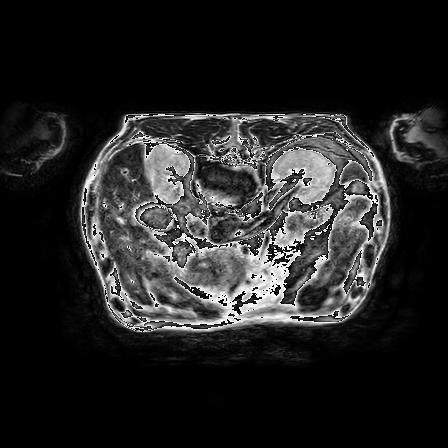</td>
<td>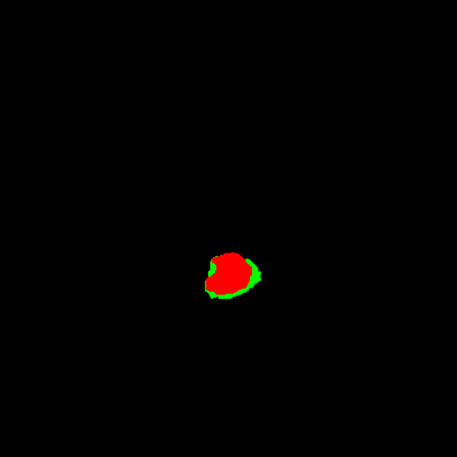</td>
<td></td>
</tr>

<tr>
<td>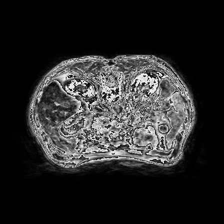</td>
<td></td>
<td>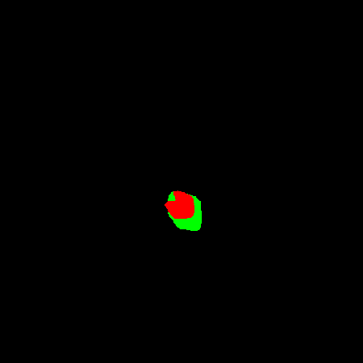</td>
</tr>

<tr>
<td>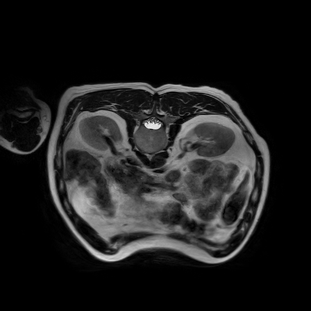</td>
<td>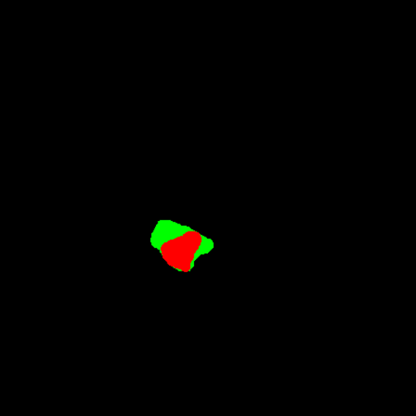</td>
<td></td>
</tr>
</table>

 
<h3>1. Dataset Citation</h3>
The dataset used here was taken from   
<b>PANTHER_Task2.zip</b> in 
<a href="https://zenodo.org/records/15192302">
<b>PANTHER Challenge: Public Training Dataset</b>
</a> on the zenodo.org web site.
  
For more information on <b>Task: Pancreatic Tumor Segmentation on MR-Linac MRIs</b>, 
please refer to 
<a href="https://panther.grand-challenge.org/tasks-evaluation/">
PANTHER Challenge Task
</a>.
  
The following explanation was taken from the above zenodo site. 
  
<b>PANTHER Challenge: Public Training Dataset</b> 
Betancourt Tarifa, Amparo Soeli; Mahmood, Faisal; Bernchou, Uffe; Koopmans, Peter Jan 
 
This dataset represents the <a href="https://panther.grand-challenge.org/">PANTHER Challenge</a>: 
Public Training Dataset</a>, comprising a total of 509 anonymized MR images. 
 The dataset is divided into two distinct tasks.   
<ul>
<li>
For Task 1, which focuses on diagnostic MR images, the dataset includes 459 scans acquired at Radboud University Medical Center. Within these, 92 images are T1-weighted contrast-enhanced arterial phase scans, supplemented by 367 scans acquired using multiple sequences. 
These images are intended to support the segmentation of pancreatic tumors in a diagnostic setting.
</li>
<li>
For Task 2, the focus shifts to treatment planning, specifically using MR-Linac images. This dataset contains 50 MR-Linac scans acquired at Odense University Hospital. By incorporating these images, the challenge aims to develop and evaluate 
AI models capable of segmenting pancreatic tumors in the context of radiotherapy planning. 
</li>
</ul>
 
<b>Citation</b> 
Betancourt Tarifa, A. S., Mahmood, F., Bernchou, U., & Koopmans, P. J. (2025). 
PANTHER Challenge: Public Training Dataset (1.0) [Data set]. Zenodo. 
https://doi.org/10.5281/zenodo.15192302 
 
<b>License</b> 
<a href="https://creativecommons.org/licenses/by-nc/4.0/legalcode">
Creative Commons Attribution Non Commercial 4.0 International</a>
 
 
<h3>
<a id="2">
2 Pancreatic-Tumor ImageMask Dataset
</a>
</h3>
<h3>2.1 Download Pancreatic-Tumor-ImageMask-Dataset</h3>
 If you would like to train this Pancreatic-Tumor Segmentation model by yourself,
 please download the dataset from the google drive  
 <a href="https://drive.google.com/file/d/18c2cZsYmJt1yfA8INDwjIaaWDBoFM3io/view?usp=sharing">
Pancreatic-Tumor-ImageMask-Dataset.zip</a> (
<a href="https://creativecommons.org/licenses/by-nc/4.0/legalcode">
Creative Commons Attribution Non Commercial 4.0 International</a>)
, expand the downloaded ImageMaskDataset and put it under <b>./dataset</b> folder to be
 
<pre>
./dataset
└─Pancreatic-Tumor
    ├─test
    │   ├─images
    │   └─masks
    ├─train
    │   ├─images
    │   └─masks
    └─valid
        ├─images
        └─masks
</pre>
 
<b>Pancreatic-Tumor Statistics</b> 
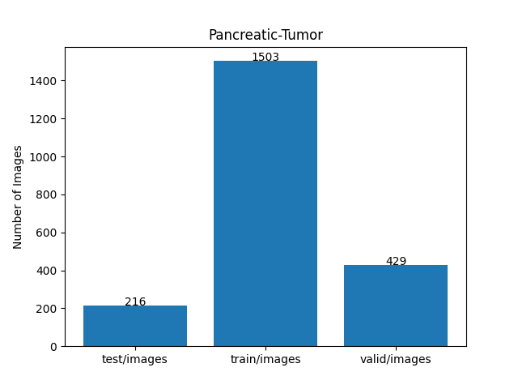 
 
As shown above, the number of images of train and valid datasets is not so large to use for the
 training set of our segmentation model.
 
<h3>2.2 Derivation of ImageMask-Dataset</h3>
The folder structor of the 
<pre>
./PANTHER_Task2
 ├─ImagesTr
 │   ├─10303_0000.mha
 ...
 │   └─10383_0000.mha
 └─LabelsTr
        ├─10303.mha
...
        └─10383.mha

</pre>
We used a simple Python script to generate our 
PNG dataset with colorized masks from the pairs of volumes <b>"ImagesTr/*.mha"</b> and
<b>"LabelTr/*.mha"</b> of PANTHER_Task2.
For simplicity, we excluded all empty black mask and their corresponding image slices of the volumes,
which were irrelevant to train our segmentation model.  

<h3>2.3 Train Sample Images and Nasks</h3>
.
<b>Train sample images</b> 
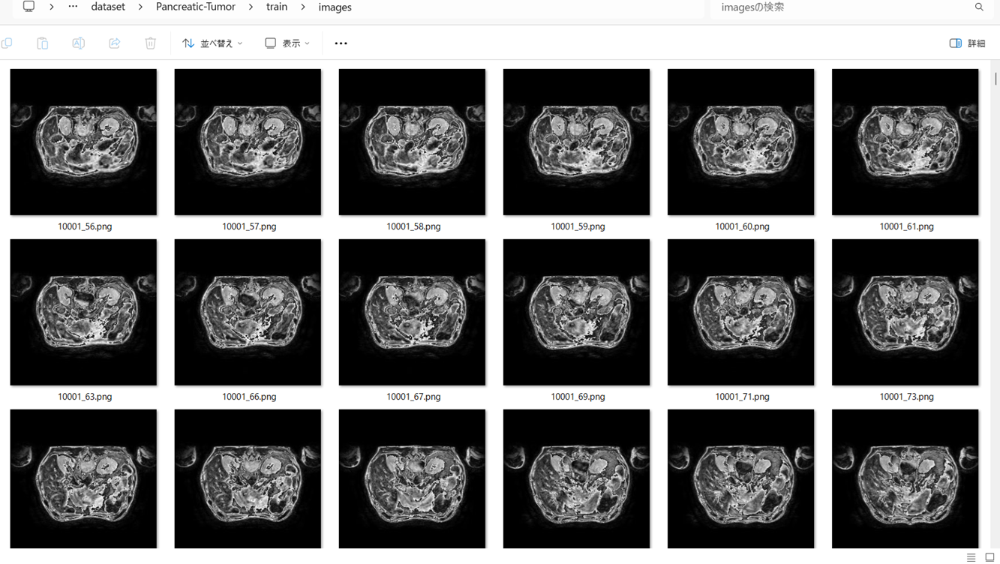
 
<b>Train sample masks</b> 
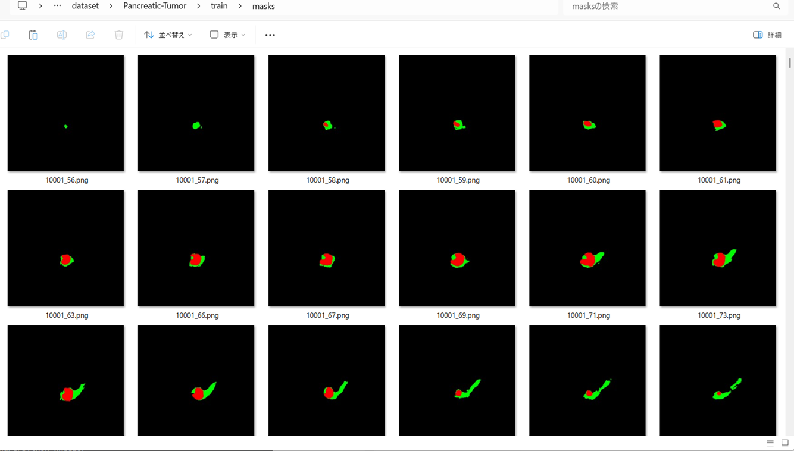
 

<h3>
3 Train TensorFlowFlexUNet Model
</h3>
 We trained Pancreatic-Tumor TensorFlowFlexUNet Model by using the 
<a href="./projects/TensorFlowFlexUNet/Pancreatic-Tumor/train_eval_infer.config"> <b>train_eval_infer.config</b></a> file.  
Please move to ./projects/TensorFlowFlexUNet/Pancreatic-Tumor and run the following bat file. 
<pre>
>1.train.bat
</pre>
, which simply runs the following command. 
<pre>
>python ../../../src/TensorFlowFlexUNetTrainer.py ./train_eval_infer.config
</pre>

<b>Model parameters</b> 
Defined a small <b>base_filters=16 </b> and large <b>base_kernels=(11,11)</b> for the first Conv Layer of Encoder Block of 
<a href="./src/TensorFlowFlexUNet.py">TensorFlowFlexUNet.py</a> 
and a large <b>num_layers=8</b> (including a bridge between Encoder and Decoder Blocks).
<pre>
[model]
;You may specify your own UNet class derived from our TensorFlowFlexModel
model         = TensorFlowFlexUNet"
image_width    = 512
image_height   = 512
image_channels = 3
input_normalize = True
normalization  = False
num_classes    = 3
base_filters   = 16
base_kernels   = (11,11)
num_layers     = 8
dropout_rate   = 0.04
dilation       = (1,1)
</pre>
<b>Learning rate</b> 
Defined a small learning rate.  
<pre>
[model]
learning_rate  = 0.00007
</pre>
<b>Loss and metrics functions</b> 
Specified "categorical_crossentropy" and <a href="./src/dice_coef_multiclass.py">"dice_coef_multiclass"</a>. 
<pre>
[model]
loss           = "categorical_crossentropy"
metrics        = ["dice_coef_multiclass"]
</pre>
<b>Dataset class</b> 
Specifed <a href="./src/ImageCategorizedMaskDataset.py">ImageCategorizedMaskDataset</a> class. 
<pre>
[dataset]
class_name    = "ImageCategorizedMaskDataset"
</pre>
 
<b>Learning rate reducer callback</b> 
Enabled learing_rate_reducer callback, and a small reducer_patience.
<pre> 
[train]
learning_rate_reducer = True
reducer_factor     = 0.4
reducer_patience   = 4
</pre>
<b>Early stopping callback</b> 
Enabled early stopping callback with patience parameter.
<pre>
[train]
patience      = 10
</pre>
<b>RGB Color map</b> 
Specifed rgb color map dict for Pancreatic-Tumor 1+2 classes. 
<pre>
[mask]
mask_datatyoe    = "categorized"
mask_file_format = ".png"
;Pancreatic-Tumor rgb color map dict for 1+2 classes.
;                     Tumor:red,      Pancreas:green
rgb_map = {(0,0,0):0, (255, 0, 0):1, (0,255,0):2 }
</pre>
<b>Epoch change inference callback</b> 
Enabled <a href="./src/EpochChangeInferencer.py">epoch_change_infer callback</a></b>. 
<pre>
[train]
epoch_change_infer       = True
epoch_change_infer_dir   =  "./epoch_change_infer"
num_infer_images         = 6
</pre>
By using this callback, on every epoch_change, the inference procedure can be called
 for 6 images in <b>mini_test</b> folder. This will help you confirm how the predicted mask changes 
 at each epoch during your training process.  
  
As shown below, early in the model training, the predicted masks from our UNet segmentation model showed 
discouraging results.
 However, as training progressed through the epochs, the predictions gradually improved. 
   
 
<b>Epoch_change_inference output at starting (epoch 1,2,3)</b> 
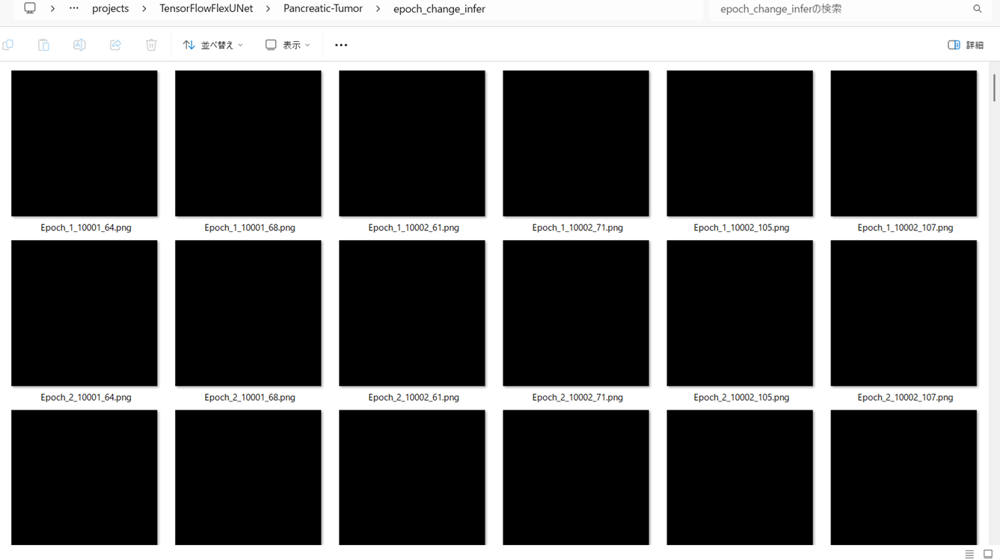 
 
<b>Epoch_change_inference output at middlepoint (epoch 23,24,25)</b> 
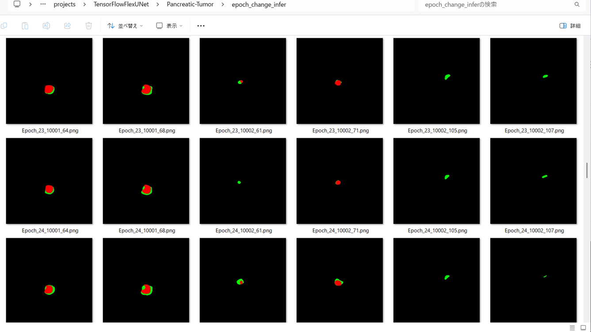 
 

<b>Epoch_change_inference output at ending (epoch 48,49,50)</b> 
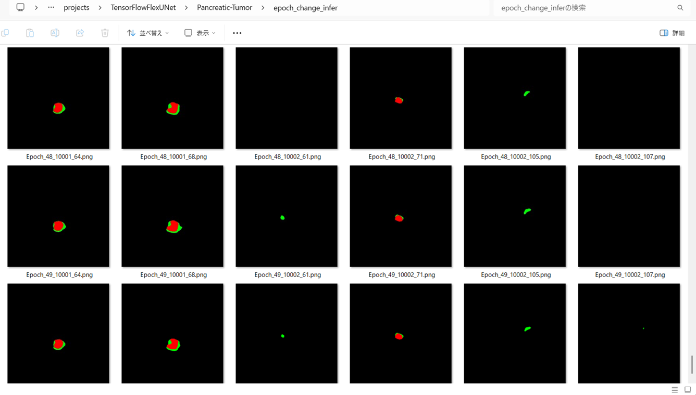 
 

In this experiment, the training process was terminated at epoch 50.  
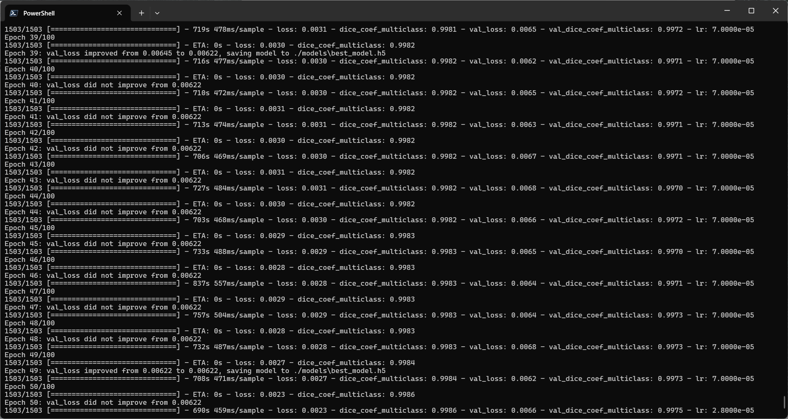 
 

<a href="./projects/TensorFlowFlexUNet/Pancreatic-Tumor/eval/train_metrics.csv">train_metrics.csv</a> 
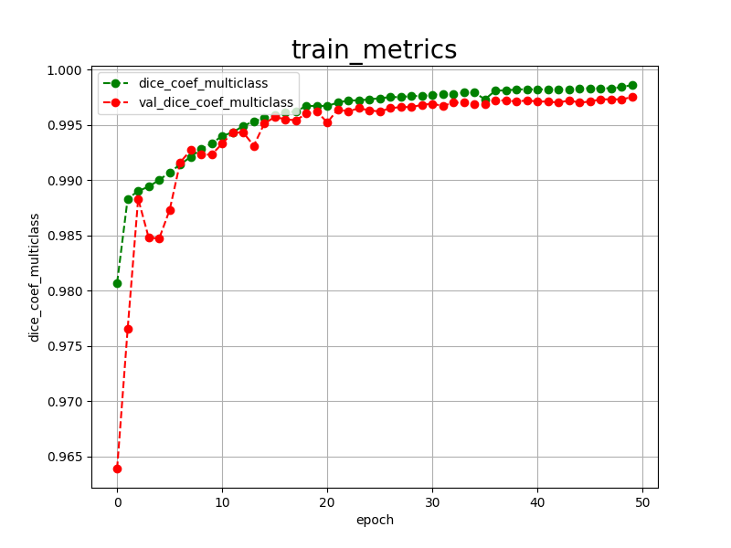 

 
<a href="./projects/TensorFlowFlexUNet/Pancreatic-Tumor/eval/train_losses.csv">train_losses.csv</a> 
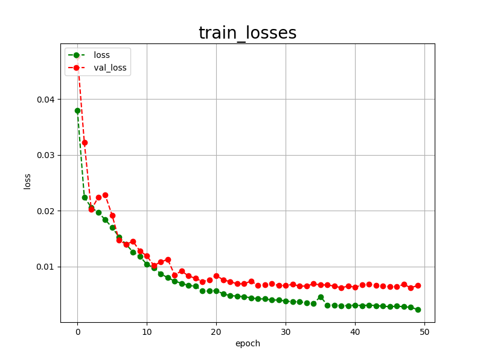 
 
<h3>
4 Evaluation
</h3>
Please move to <b>./projects/TensorFlowFlexUNet/Pancreatic-Tumor</b> folder, 
and run the following bat file to evaluate TensorFlowUNet model for Pancreatic-Tumor. 
<pre>
>./2.evaluate.bat
</pre>
This bat file simply runs the following command.
<pre>
>python ../../../src/TensorFlowFlexUNetEvaluator.py ./train_eval_infer_aug.config
</pre>

Evaluation console output: 
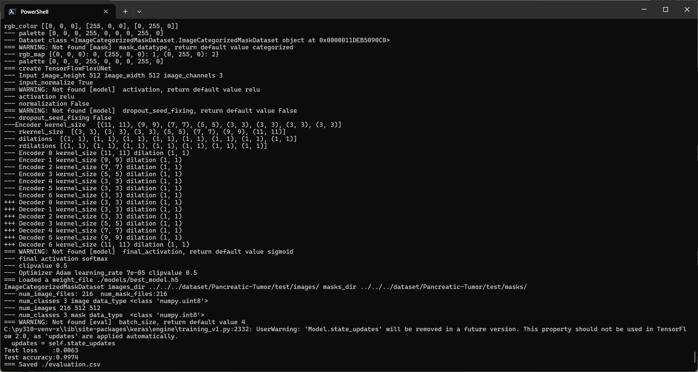
  Image-Segmentation-Pancreatic-Tumor

<a href="./projects/TensorFlowFlexUNet/Pancreatic-Tumor/evaluation.csv">evaluation.csv</a> 
The loss (categorical_crossentropy) to this <b>Pancreatic-Tumor/test</b> was very low and dice_coef_multiclass very high as shown below.
 
<pre>
categorical_crossentropy,0.0063
dice_coef_multiclass,0.9974
</pre>
 
<h3>
5 Inference
</h3>
Please move to a <b>./projects/TensorFlowFlexUNet/Pancreatic-Tumor</b> folder 
,and run the following bat file to infer segmentation regions for images by the Trained-TensorFlowUNet model for Pancreatic-Tumor. 
<pre>
>./3.infer.bat
</pre>
This simply runs the following command.
<pre>
>python ../../../src/TensorFlowFlexUNetInferencer.py ./train_eval_infer_aug.config
</pre>

<b>mini_test_images</b> 
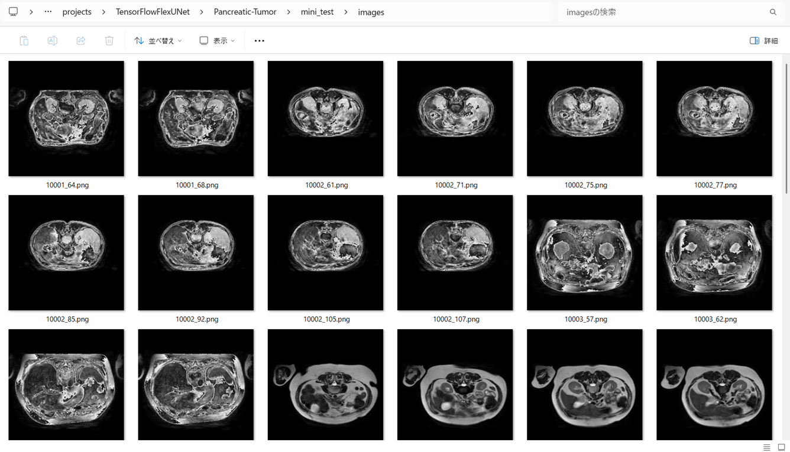 
<b>mini_test_mask(ground_truth)</b> 
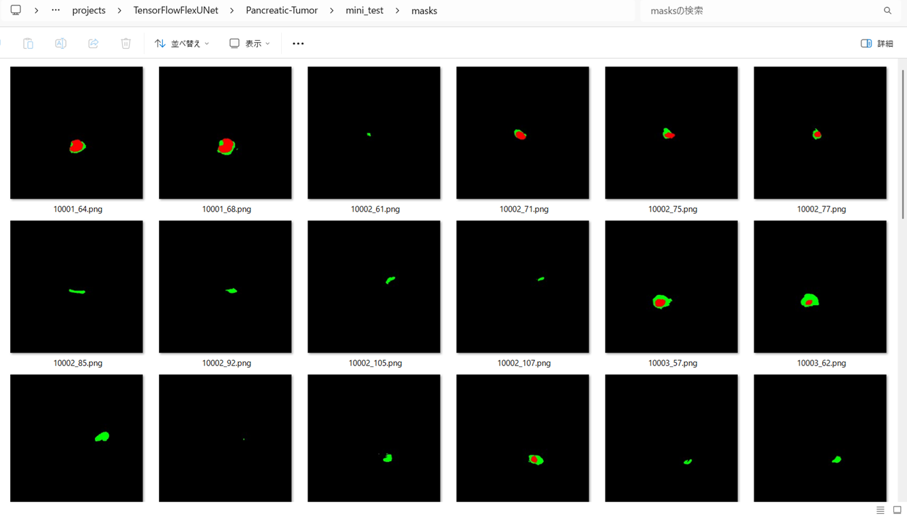 

<b>Inferred test masks</b> 
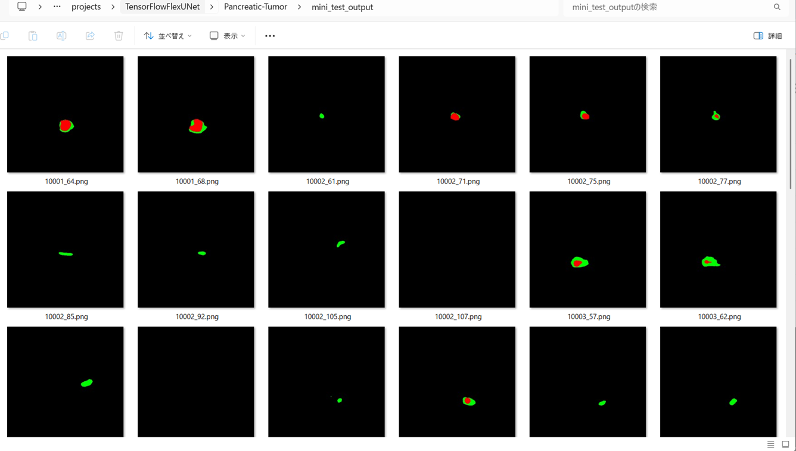 
 

<b>Enlarged images and masks of Pancreatic-Tumor Images of 512x512 pixels</b> 
As shown below, the inferred masks predicted by our segmentation model trained by the dataset appear similar to the ground truth masks,
 but they lack precision in certain areas.
  
<b>class_color_map = {Tumor:red,  Pancreas:green}</b>
  
<table>
<tr>
<th>Image</th>
<th>Mask (ground_truth)</th>
<th>Inferred-mask</th>
</tr>
<tr>
<td></td>
<td></td>
<td></td>
</tr>

<tr>
<td>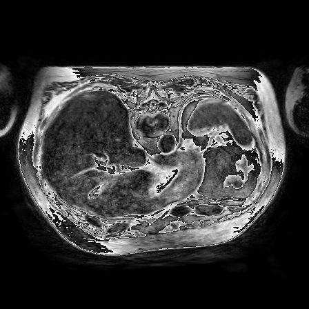</td>
<td></td>
<td></td>
</tr>

<tr>
<td></td>
<td></td>
<td></td>
</tr>

<tr>
<td>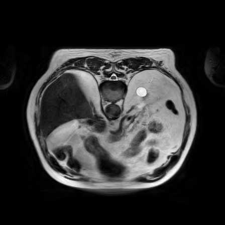</td>
<td></td>
<td>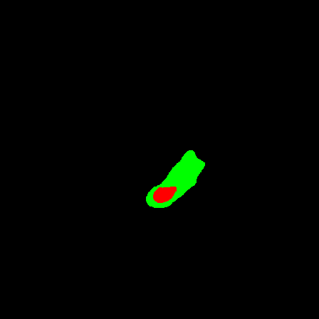</td>
</tr>

<tr>
<td></td>
<td></td>
<td></td>
</tr>

<tr>
<td>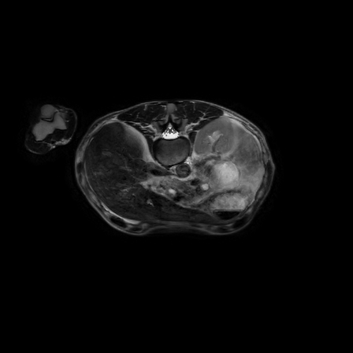</td>
<td>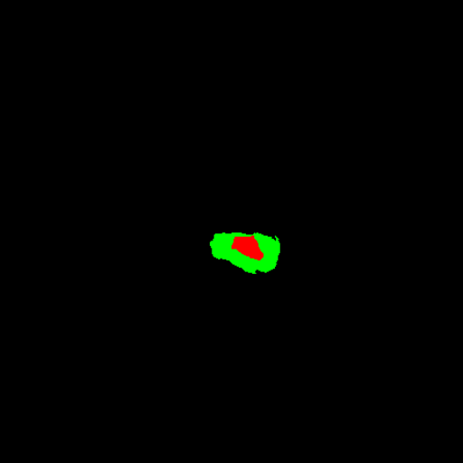</td>
<td></td>
</tr>
</table>

 
 
<h3>
6 3D Volume Segmentation
</h3>
Please move <b>./projects/TensorFlowFlexUNet/Pancreatic-Tumor</b> folder, and run the following bat file to infer images segmentation for 2D slices of 3D volume NIfTI files
 by the Trained-TensorFlowFlexUNet model for Pancreatic-Tumor. 
<pre>
>./5.infer3d.bat
</pre>
This simply runs the following command.
<pre>
>python ../../../src/TensorFlowFlexUNet3DInferencer.py ./train_eval_infer.config
</pre>

<b>infer3d section </b> in <a href="./projects/TensorFlowFlexUNet/Pancreatic-Tumor/train_eval_infer.config">
train_eval_infer.config
<a></b>
<pre>
[infer3d] 
;Specify an images_dir which contains NIfTI or MHA files
images_dir    = "./mini_test_3d/images/"
output_dir    = "./mini_test_3d_output/"
slice_shape_order = "dhw"
slice_normalize = True
slice_resize   = (512,512)
slice_rotation = None
mask_overlay  = True
</pre>

<b>Acutual Image Segmentation for 2D Slices of a Pancreatic-Tumor MHA</b> 
Some Slices, Inferred Masks and Mask overlays for a 3D volume <b>10365_0000.mha</b> file. 
 
<b>class_color_map = {Tumor:red,  Pancreas:green}</b>
 
<table>
<tr>
<th>Input: Slice</th>
<th>Prediction: Inferred mask</th>
<th>Mask Overlay</th>
</tr>
<tr>
<td>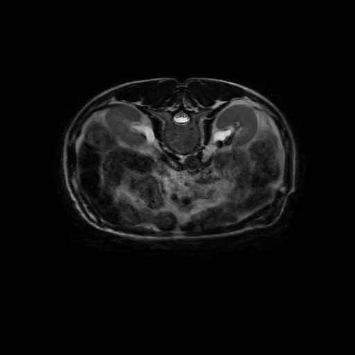</td>
<td>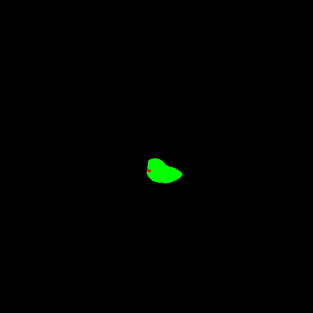</td>
<td>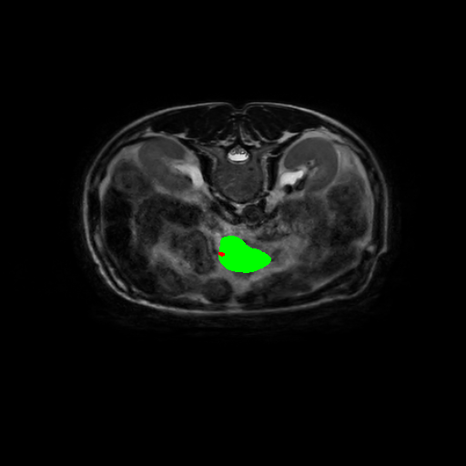</td>
</tr>
<tr>
<td>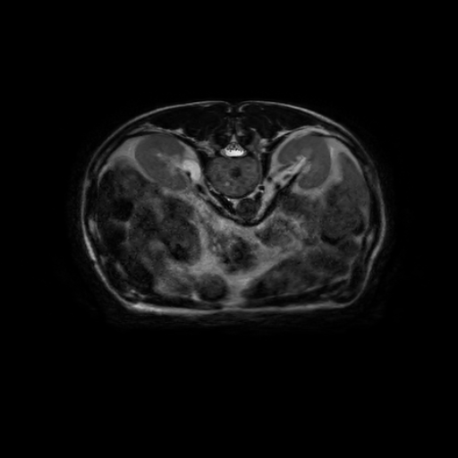</td>
<td>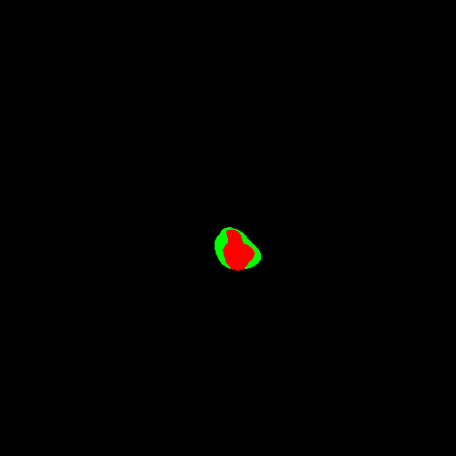</td>
<td>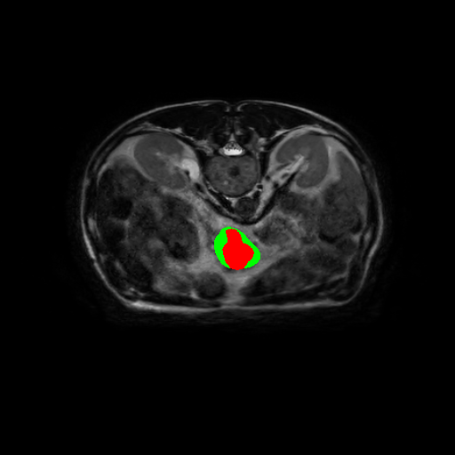</td>
</tr>
<tr>
<td>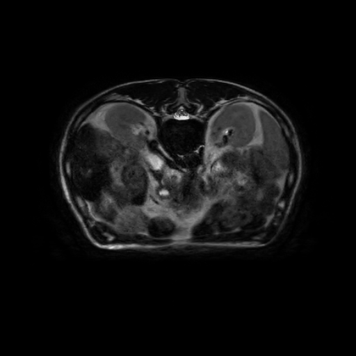</td>
<td>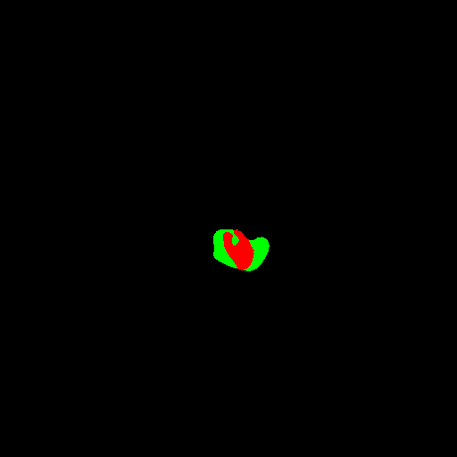</td>
<td>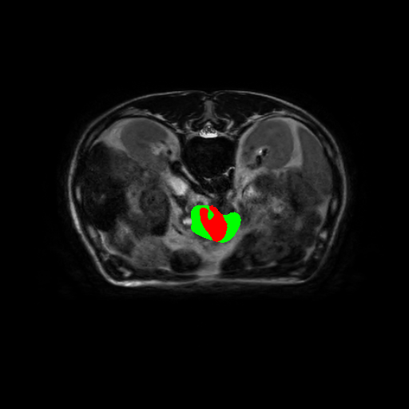</td>
</tr>
<tr>
<td>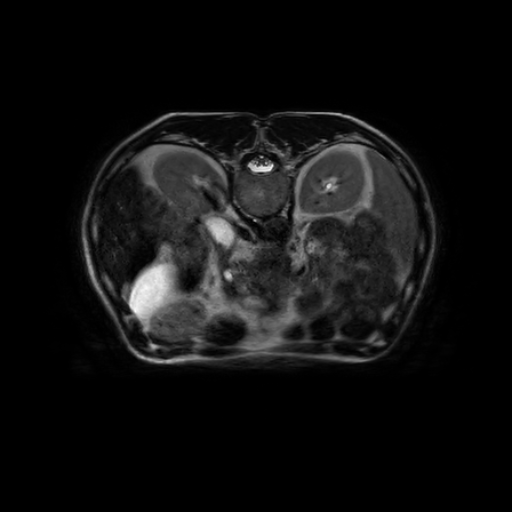</td>
<td>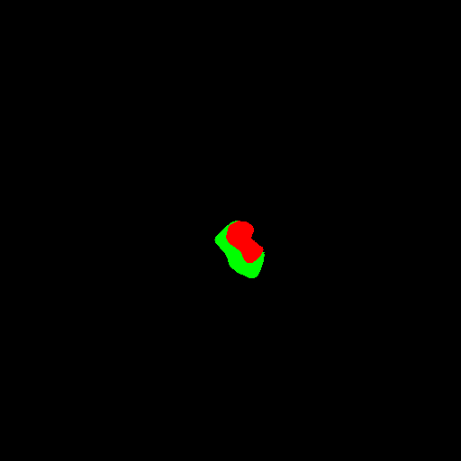</td>
<td>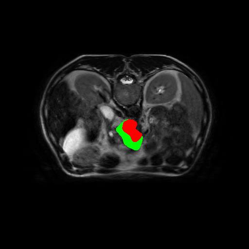</td>
</tr>
<tr>
<td>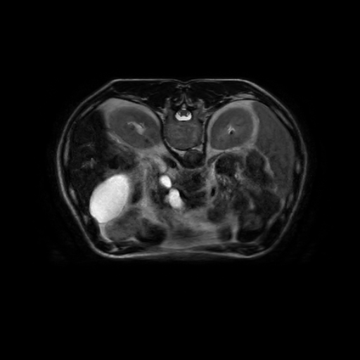</td>
<td></td>
<td>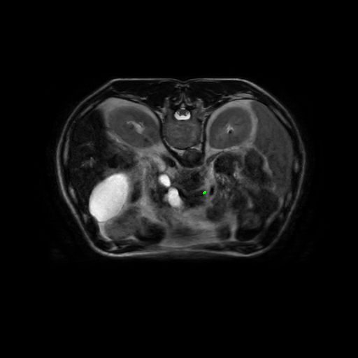</td>
</tr>
<tr>
<td>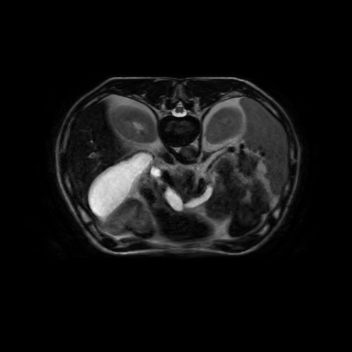</td>
<td></td>
<td>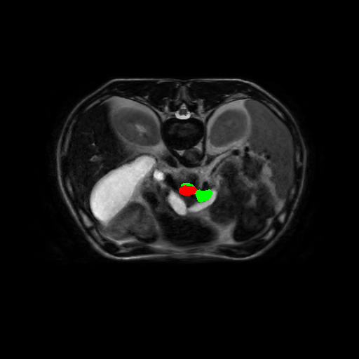</td>

</tr>
</table>

 
 
<h3>
7 MaskOverlay Video of 3D Volume Segmentation
</h3>
Please move to <b>./projects/TensorFlowFlexUNet/Pancreatic-Tumor</b> folder, and run the following bat file 
to generate <b>overlays.mp4</b> or <b>overlay.gif</b> for MaskOverlays of 3D Volume Segmentation.  
<pre>
>./6.video3d.bat
</pre>
This simply runs the following command.
<pre>
>python ../../../src/MaskOverlayVideoGenerator.py ./train_eval_infer.config
</pre>
 

<b>infer3d section </b> in <a href="./projects/TensorFlowFlexUNet/Pancreatic-Tumor/train_eval_infer.config">
train_eval_infer.config
<a></b>

<pre>
[infer3d] 
mask_overlay  = True
;Specify ".mp4" or ".gif".
;video_fileformat  = ".mp4"
video_fileformat  = ".gif"
</pre>
 
<b>overlays.gif</b> 

 
 
<h3>
References
</h3>
<b>1. TensorFlow-FlexUNet-Image-Segmentation-Pancreas-T2W-MRI</b> 
Toshiyuki Arai 
<a href="https://github.com/sarah-antillia/TensorFlow-FlexUNet-Image-Segmentation-Pancreas-T2W-MRI">
https://github.com/sarah-antillia/TensorFlow-FlexUNet-Image-Segmentation-Pancreas-T2W-MRI</a>
  
<b>2. TensorFlow-FlexUNet-Image-Segmentation-Model</b> 
Toshiyuki Arai 
<a href="https://github.com/sarah-antillia/TensorFlow-FlexUNet-Image-Segmentation-Model">
https://github.com/sarah-antillia/TensorFlow-FlexUNet-Image-Segmentation-Model</a>
  

